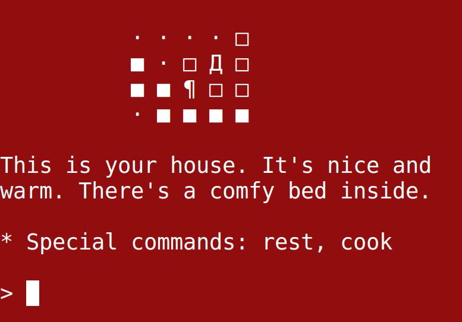

# Ayara



Ayara is a text-RPG made with the [Goby](https://github.com/nskins/goby) framework. It was originally developed over the course of a few weeks and released in January 2017. For historical reasons, the original PR is available [here](https://github.com/nskins/goby/pull/77).

The game takes place in a small city; there is no clearly-defined goal. Exploration is of the utmost importance in Ayara. You will find that there are different ways to achieve the same end. It is an RPG in the most true sense - you can play as a fisherman, a martial artist, or even a local basketball star!

## Instructions

Install the dependencies:

```bash
$ bundle
```

You can improve your game-playing experience by updating a few settings in your terminal first. Specifically, you want to make sure you are using a monospace font (like "Monospace") and a font size of around 28. Also, put the terminal in full screen to enable automatic scrolling.

Start the game:

```bash
$ ruby src/main.rb
```

When you start up the game, there is a short tutorial to teach you how to play.